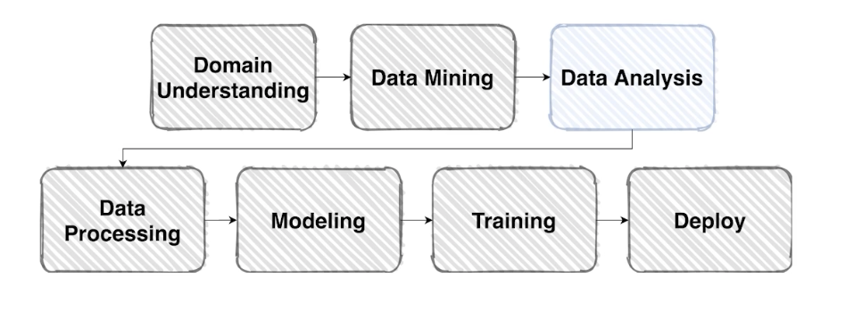

# EDA

### **EDA(Exploratory Data Analysis)란?**

→ 수집한 데이터를 다양한 각도에서 관찰하고 이해하는 과정

“데이터를 이해하기 위한 노력”

**How to EDA?**

EDA에는 정답이 없다!

주어진 데이터에 대해 궁금하거나 분석하고 싶은 내용을 자유롭게 분석하는 것이 EDA의 방법이다.

**그럼에도 EDA가 왜 어렵게 느껴질까?**

→ 자신이 왜 EDA를 어렵게 생각하는지 다시 한 번 생각해보자.

나의경우 : 

1. 기본적인 데이터 핸들링 말고는 어떤 부분을 더 분석해야 할 지 모르겠다.
2. EDA에서 시간을 많이 쏟는 것이 맞나 싶다.
3. 아직 경험이 부족하다.

EDA의 진짜 목적은 궁금한 것을 알아보는 것이다 ⇒ **데이터를 아는 과정**

> “노이즈가 섞인 데이터가 있을까?” → 스크롤을 내리며 노이즈가 섞인 이미지가 있는지 찾아본다.
> 

복잡하고 기술적인 것 뿐만 아니라 단순한 데이터 궁금증에 대한 해결도 EDA 과정이 될 수 있다. 너무 어렵게 생각하여 겁먹지 말고 할 수 있는 것부터 차근차근 해보자. 경험이 쌓이면 점점 나아가서 기술적인 핸들링도 가능해질 것이다.

**전체 Process**

EDA는 무한반복이다. 도중에 떠오르는 아이디어로 인해 다시 EDA 단계로 돌아갈 수 있다!!