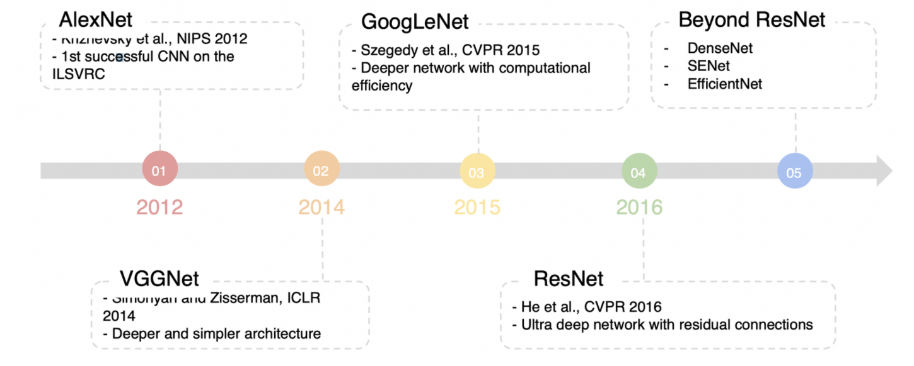
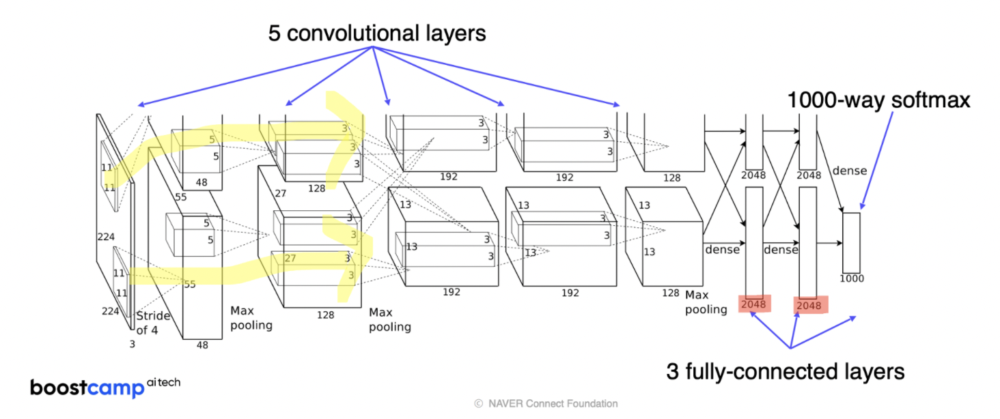
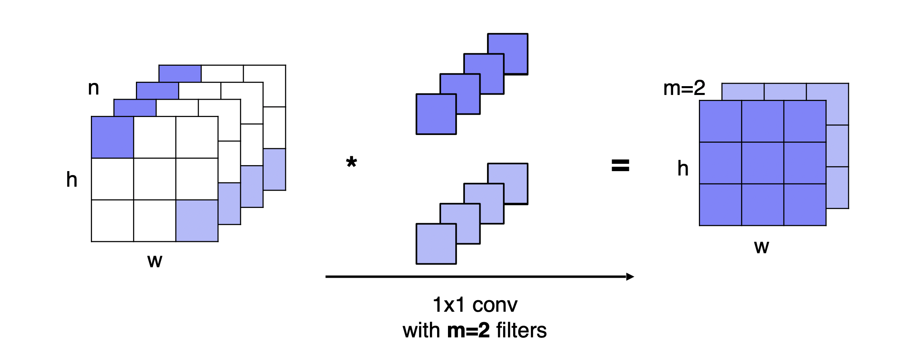
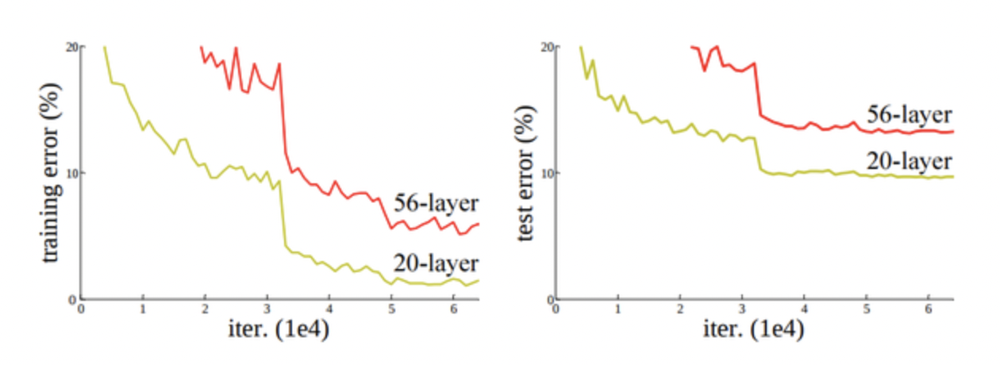
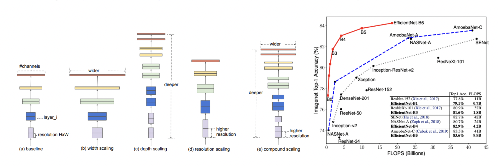
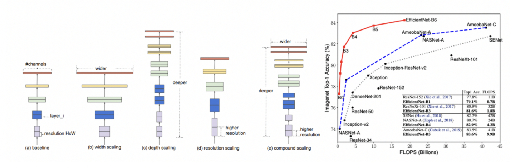

# History of Neural Networks

Week: 8주차

# AlexNet

간단한 CNN architecture

<aside>
💡 Overall architecture: Conv - Pool - Conv - Pool - FC – FC

- Convolution: 5x5 filters with stride 1
- Pooling: 2x2 max pooling with stride 2
</aside>

Alexnet은 두 갈래의 path가 존재한다. 당시만 해도 이 network를 감당할 memory가 부족하였기에 한 번에 진행하지 않고 두 갈래로 나누어 2개의 GPU를 사용했다고 한다.

path1(윗부분) : 주로 color와 상관없는 feature 추출

path2(아랫부분) : 주로 color와 관련된 feature을 추출

Alexnet의 주요 특징으로는

1. 11x11 convolution filter 
    
    → 이전 네트워크에 비해 필터 사이즈가 늘어남에 따라 input image의 사이즈도 함께 증가했다.
    
2. ReLU 사용
    
    → sigmoid나 tanh를 사용했을 때보다 6배 이상 높은 성능을 보여주었다.
    

# VGGNet

- Deeper architecture : 16 and 19 layers
- Simple architecture : No local response normalization, only 3x3 conv filters blocks, 2x2 max pooling
- Better Performance : Alexnet에 비해 현저히 우수한 성능
- Better generalization : 다른 task에서도 성능이 잘 나오는 우수한 일반화 성능 보유
- 큰 conv filter 대신 3x3 conv layer를 여러개 쌓음으로써 적은 파라미터로도 큰 receptive field 형성 가능
    - receptive field : 추출된 어떠한 feature에 대해 입력영상이 미치는 영역

# GoogLeNet

**Key Idea : Inception module**

다양한 필터를 적용하여 concatenate 한다.

오른쪽 그림을 보면 **1x1 convolution**을 사용하는데 이것이 GoogLeNet의 핵심이다.

이렇게 1x1 convolution을 여러겹 쌓으면 filter의 갯수만큼 채널이 생기지만 공간적인 크기는 바뀌지 않는다는 장점이 있다.

<aside>
❓ 채널이 늘어나는 것의 긍정적인 의미는?

</aside>

<aside>
💡 Overall architecture

- Stem network : vanilla convolution networks
- Stacked inception modules
- Auxiliary classifiers : back propagation 중 vanishing gradient 문제를 해결하기 위해 중간중간 gradient를 입력해주는 것 → 맨 밑까지 gradient를 보내줄 수 있게됨 (학습때만 사용)
- Classifier output (a single FC layer)
</aside>

# ResNet

근래에 자주 사용되는 model

![[img6] CIFAR-10 데이터에 대한 training error(왼쪽) 그리고 test error(오른쪽)](Image3_1/img6.png)

**Degradation** 문제 발생 : 어느정도 이상 깊어진 네트워크에서 vanishing/exploding gradient 문제 때문에 성능이 더 떨어지는 문제

**→ ResNet은 이를 해결 하기 위해 shortcut connection을 사용**

![[img7] 기존 neural net과 residual net](Image3_1/img7.png)

Plain net 보다 Residual net이 더 학습이 쉽다는 가정을 사용했다.

<aside>
💡 Overall architecture

- Convolutional Layer : 3x3 Filter 사용 (특징맵의 크기가 같은 레이어는 필터의 갯수도 같고, 특징맵의 크기가 절반으로 줄어들면 필터의 갯수는 두배로 증가시킴)
- Pooling Layer : Stride = 2의 Downsampling 적용, Fully-Connected Layer 이전에 Avg Pooling 적용
- Residual Network : 매 두 장의 레이어마다 Shortcut 삽입 (x와 H(x)의 Dimension을 맞추기 위해 Zero-Padding과 1x1 Conv Layer 적용)
- 총 레이어 갯수 : 34
</aside>

# Beyond ResNet

1. DenseNet
2. SENet
3. EfficientNet

### EfficientNet

Deep, Wide, and high Resolution networks

(b),(c),(d) 모두 성능 향상에 도움이 되는 방법인데 이들을 적절히 섞어 더 우수한 성능을 내는 모델이다.

오른쪽 그래프에서 검정색 선은 사람이 손으로 만든 모델인데 이것보다 빨간 선인 EfficientNet이 더 우수한 성능을 보인다!

# Summary..

**AlexNet**

- simple CNN architecture
- Simple computation, heavy memory size
- Low accuracy

**VGGNet**

- simple with 3x3 convolutions
- highest memory, the heaviest computation

**GoogLeNet**

- inception module and auxiliary classifier

**ResNet** 

- deeper layers with residual blocks
- moderate efficiency

<aside>
☑️ **GoogLeNet이 가장 효율적인 CNN model이다. 하지만 사용하는 것이 복잡하다.
그렇기에 요즘은 단순하지만 강력한 VGGNet 이나 ResNet을 backbone model로 사용한다.**

</aside>