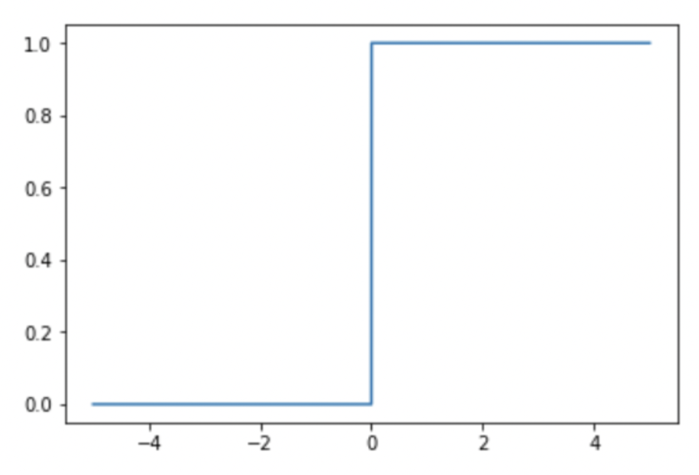

# Activation Function

Activation Function : 입력 데이터를 다음 레이어로 어떻게 출력하느냐를 결정하는 역할

## 1. Step Function

0을 기준으로 0보다 작으면 데이터를 보내지 않고, 0보다 같거나 크면 데이터를 보내는 유형의 함수

- 미분불가능
- 실제로는 거의 사용 x

## 2. Sigmoid Function

- 미분이 가능해짐
- 함수값이 (0, 1)로 제한
- vanishing gradient 문제 발생
- Sigmoid 함수의 중심이 0이 아닌데, 이 때문에 학습이 느려질 수 있는 단점
    
    → sigmoid zero centered
    
- sigmoid()의 리턴 값이 확률 값이기 때문에 결과를 확률로 해석할 때 유용

## 3. tanh 함수(Hyperbolic Tangent Function)

- 함수의 중심점을 0으로 옮겨 sigmoid가 갖고 있던 최적화 과정에서 느려지는 문제를 해결
- 여전히 vanishing gradient 문제 발생

## 4. Softmax 함수

input값을 [0,1] 사이의 값으로 모두 정규화하여 출력하며, 출력값들의 총합은 항상 1이 되는 특성을 가진 함수

- 다중분류(multi-class classification) 문제에서 사용
- 출력층에서 사용
- 분류될 클래스가 n개라 할 때, n 차원의 벡터를 입력받아, 각 클래스에 속할 확률을 추정.

## 5. ReLU 함수

가장 많이 사용하는 함수로, Sigmoid와 tanh가 갖는 Gradient Vanishing 문제를 해결

- vanishing gradient 문제 해결
- sigmoid, tanh 함수와 비교시 학습이 훨씬 빨라짐
- 연산 비용이 크지않고, 구현이 매우 간단
- x<0 인 값들에 대해서는 기울기가 0이기 때문에 뉴런이 죽을 수 있는 knockout 문제 발생 가능

## 6. Leaky ReLU / Parametric ReLU

**Leaky ReLU**

**Parametric ReLU**

Leaky ReLU

Parametric ReLU

ReLU가 갖는 Dying ReLU(뉴런이 죽는 현상) 을 해결하기 위해 나온 함수

- 꼭 0.01이 아닌 다른 작은 수를 써도 됨
- knockout 문제 해결

음수에 대한 gradient를 변수로 두고 학습을 통하여 업데이트

- knockout 문제 해결

**그 외...**

⇒ **속도, 연산비용,성능을 고려했을 때 ReLU를 가장 많이 사용함**

**[Reference]**

[https://m.blog.naver.com/good5229/221752705030](https://m.blog.naver.com/good5229/221752705030)

[https://89douner.tistory.com/22](https://89douner.tistory.com/22)

[https://m.blog.naver.com/PostView.naver?isHttpsRedirect=true&blogId=handuelly&logNo=221824080339](https://m.blog.naver.com/PostView.naver?isHttpsRedirect=true&blogId=handuelly&logNo=221824080339)

[https://balmostory.tistory.com/52](https://balmostory.tistory.com/52)