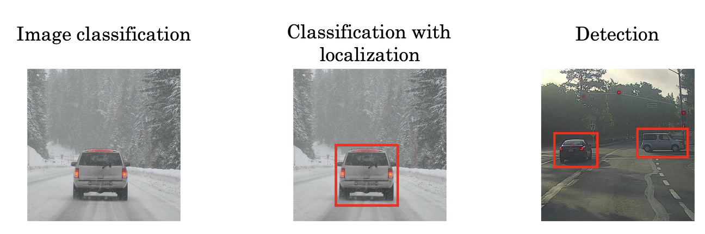

# Localization

## Localization은 무엇일까요?

**[Answer]**

**이미지 안의 Object 가 이미지 안의 어느 위치에 있는지 위치 정보를 출력해주는 것으로, 주로 Bounding box 를 많이 사용합니다.**

- 이미지를 car라고 분류하는 것을 **'Image classification'**
- car가 이미지 속 어디에 있는지까지 알아내는 것을 **'Classification with localization'**
- localization을 사용해, 이미지에서 하나의 객체가 아닌 여러 객체를 인식하는 것을 **'Detection'**

**Bounding Box의 좌표**는 bx, by, bh, bw로 이루어져 있다.

- bx : bounding box의 중심점 x좌표 (format에 따라 변동)
- by : bounding box의 중심점 y좌표 (format에 따라 변동)
- bh : bounding box의 높이
- bw : bounding box의 너비