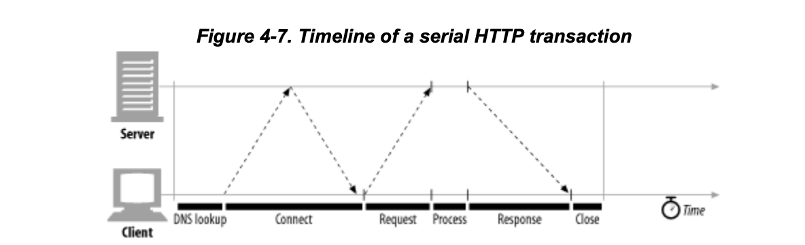
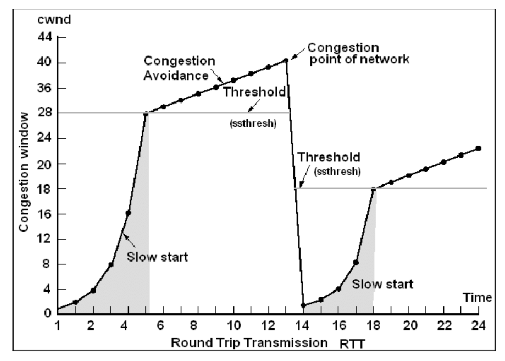
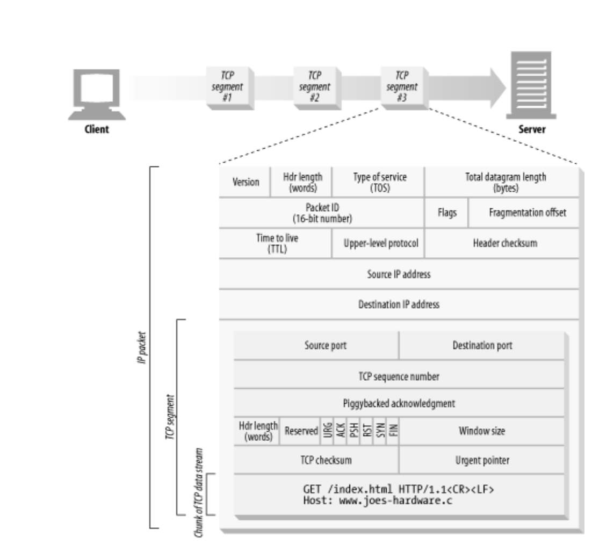

# HTTP 커넥션

## HTTP 트랜잭션

HTTP 트랜잭션은 요청과 응답으로 구성되어 있고, HTTP 메세지를 이용해 이루어진다.

- HTTP 요청 메시지는 명령과 URI를 포함한다.
- HTTP 응답 메시지는 트랜잭션의 결과를 포함한다.

### 메서드

<table>
  <tr>
  <th>HTTP 메서드</th>
  <th>설명</th>
  </tr>
  <tr>
  	<td>GET</td>
    <td>서버에서 클라이언트로 지정한 리소스를 보내라</td>
  </tr>
  <tr>
  	<td>POST</td>
    <td>클라이언트 데이터를 서버 게이트웨이 어플리케이션으로 보내라</td>
  </tr>
  <tr>
  	<td>PUT</td>
    <td>클라이언트에서 서버로 보낸 데이터를 지정한 이름의 리소스로 저장하라</td>
  </tr>
  <tr>
  	<td>DELETE</td>
    <td>지정한 리소스를 서버에서 삭제하라</td>
  </tr>
  <tr>
  	<td>HEAD</td>
    <td>지정한 리소스에 대한 응답에서, HTTP 헤더부분만 보내라 </td>
  </tr>
</table>

### 상태 코드

모든 HTTP 응답 메시지는 상태 코드와 함께 반환된다. 상태코드는 클라이언트에게 요청이 성공했는지 아니면 추가 조치가 필요한지 알려주는 세자리 숫자다.

- 2xx : 성공
- 3xx : 리다이렉트
- 4xx : 클라이언트 오류
- 5xx : 서버 오류

### 웹 페이지는 여러 객체로 이루어질 수 있다.

## 메시지

HTTP는 일반 텍스트로 이루어진 단순한 줄 단위 문자열

- 요청 메시지 : 웹 클라이언트에서 서버로 보낸 HTTP 메시지
- 응답 메시지 : 웹 서버에서 클라이언트로 가는 메시지

 출처 - [MDN HTTP 메시지](https://developer.mozilla.org/ko/docs/Web/HTTP/Messages)

- 시작 줄
  - 메시지 의 첫 줄은 시작 줄로, 요청이라면 무엇을 해야하는지, 응답이라면 무슨 일이 일어났는지 나타낸다.
- 헤더
  - 시작줄 다음에는 0개 이상의 헤더 필드가 이어진다. 각 헤더 필드는 쉬운 구문분석을 위해 `:` 로 구분되어 있는 하나의 이름과 하나의 값으로 구성된다. 헤더 필드를 추가하려면 한 줄을 더하면 된다. 헤더는 빈줄로 끝난다.
- 본문
  - 빈줄 다음에는 어떤 종류의 데이터든 들어갈 수 있는 메시지 본문이 필요에 따라 올 수 있다. 텍스트 뿐 아니라 이진 데이터도 포함할 수 있다.

---

## TCP 커넥션

### TCP/IP

HTTP는 애플리케이션 계층 프로토콜이다. HTTP는 네트워크 통신의 핵심적인 세부사항에 대해서 신경 쓰지 않는다. 대신 대중적이고 신뢰성있는 프로토콜인 TCP/IP 에게 맡긴다.

- TCP 제공
  - 오류 없는 데이터 전송
  - 순서에 맞는 전달(데이터는 언제나 보낸 순서대로 도착한다)
  - 조각나지 않는 데이터 스트림 (언제든 어떤 크기로든 보낼 수 있다)

TCP/IP는 TCP와 IP가 층을 이루는 패킷 교환 네트워크 프로토콜의 집합

  
출처 - [velog](https://media.vlpt.us/images/hangem422/post/897f8f0c-e034-4943-a5d6-38e3987ff91d/http0403.png)

## TCP/IP 커넥션

HTTP 클라이언트가 서버에 메시지를 전송할 수 있게 되기 전에, IP주소와 포트번호를 사용해 클라이언트와 서버 사이에 TCP/IP 커넥션을 맺어야한다. -> **URL을 이용**하면 된다.

URL은 리소스를 가지고 있는 장비에 대한 IP주소와 포트번호를 알려줄 수있다.

> - 웹브라우저는 서버의 URL에서 호스트 명을 추출한다.
> - 웹브라우저는 서버의 호스트 명을 IP로 변환한다.
> - 웹브라우저는 URL에서 포트번호(있다면)를 추출한다.
> - 웹브라우저는 웹서버와 TCP 커넥션을 맺는다.
> - 웹브라우저는 서버에 HTTP 요청을 보낸다.
> - 서버는 웹브라우저에 HTTP 응답을 돌려준다.
> - 커넥션이 닫히면, 웹브라우저는 문서를 보여준다.

---

## HTTP 트랜잭션 지연

- 트랜잭션 처리 시간 : TCP 커넥션 설정 + **요청 전송+ 처리 + 응답 메시지** + TCP 커넥션 종료

- 지연 원인
  - DNS 찾기 지언 : URI로 부터 웹 서버의 IP와 Port번호를 알아내는 과정
  - 커넥션 생성 지연 : TCP 커넥션 요청
  - 요청과 응답 지연 : HTTP 요청 전송, 요청메시지 처리, HTTP 응답
  - 하드웨어, 전송속도, 메시지 크기, 거리 등
- 요청, 응답 데이터가 엄청 크지 않는 한 HTTP지연은 TCP 네트워크 지연때문에 발생한다.

### 3-way handshake

실제 요청, 응답 시간보다 연결하는 시간 지연이 큼

### 확인응답 지연, 편승

- 확인응답 지연 알고리즘
- ACK을 보내기 전에 다음에 보낼 데이터가 있는지 조금 기다린다.

### slow start

- 처음 연결된 커넥션은 slow start때문에 전송이 느리다.

### nagle algoirthm

- ACK이 오거나, 버퍼 사이즈가 다 찰때까지 보내지 않는다.

### time_wait

time wait을 하는 이유

- port, ip 같은게 할당되어서 연결이 끊어진 커넥션과 새로 생성된 커넥션이 겹쳐 혼란을 줄 까봐

TCP_NODELAY, TW_REUSE=1 (default=0) 로 바꿔주면 타임웨잇되어있는 소켓 재사용 가능해짐

### 지속 커넥션, Keep alive

