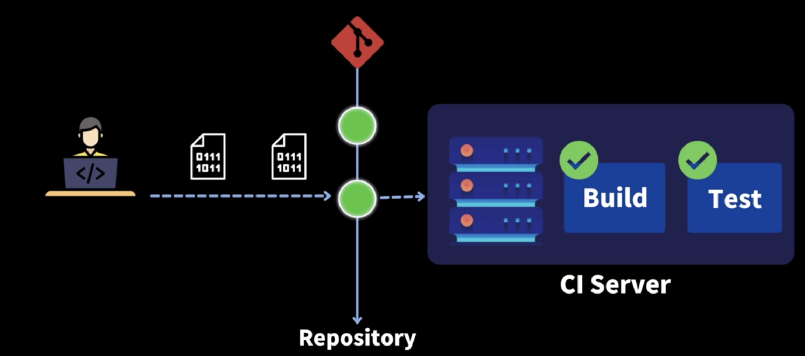
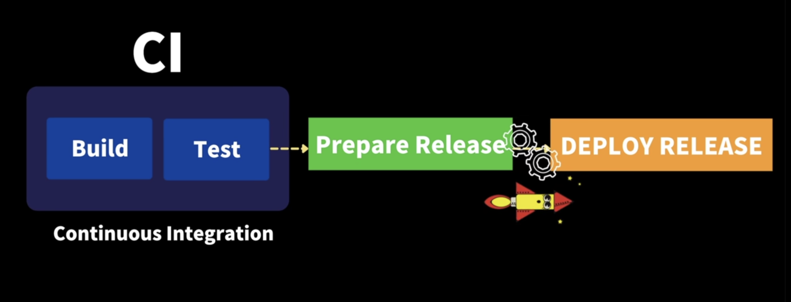
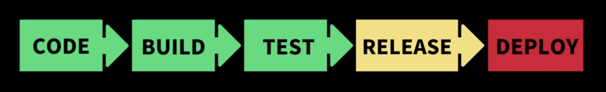

## DevOps
>*소프트웨어의 개발(<u>Dev</u>elopment) + 운영(<u>Op</u>eration<u>s</u>)*

소프트웨어 개발자와 정보기술전문가(운영자) 간의 소통, 협업 및 통합을 강조하는 <u>**개발 환경**</u>이나 <u>**문화**</u>를 말합니다.

### DevOps가 나타나게 된 이유
소프트웨어 개발부터 배포될 때까지 *기획, 개발, 빌드, 테스트, 배포, 모니터링, 인프라 등* 다양한 과정을 거치게 되는데, 각 과정은 반복적이고 불필요한 작업과 오버헤드가 발생하게 됩니다. 결과적으로 배포 주기가 길어지고 변경 사항이 커져 배포의 위험성이 증가합니다.  

### DevOps 목적
따라서 개발부터 배포까지 모든 단계에 <u>**자동화**</u>와 <u>**모니터링**</u>을 도입해서 더 짧은 개발 주기, 더 많은 배포 빈도, 안정적인 소프트웨어를 배포하자는 목표로 DevOps라는 개념이 등장하였습니다.

- 제품 출시까지 걸리는 기간 (time to market) 단축
- 배포 시 낮은 실패율
- 복구 시 빠르게 복구할 수 있다.

>속도, 빠른 배포, 협업 강화, 품질 향상, 보안

### DevOps 방식
##### DevOps의 모범 사례 입니다.
1. 지속적 통합 (CI)
2. 지속적 전달 (CD)
3. 마이크로 서비스
4. 코드형 인프라
5. 모니터링 및 로깅
6. 커뮤니케이션 및 협업

  

## 지속적 통합 (Continuis Integration: CI)
버그 수정이나 새로 만든 기능들이 main repository 에 주기적으로 빌드되고 테스트되어 merge되는 것

1. 개발자들은 코드 변경사항을 **주기적으로 빈번**하게 main repository 에 **merge** 해야한다.
> 최대한 작은 단위로 나누어서 개발하고 통합해야한다.

2. 통합을 위한 단계: 주기적으로 머지된 코드의 변경사항이 <u>**자동으로 빌드**</u>가 되어서 코드 변경사항 이후에도 빌드가 성공적으로 되는지 확인이 되어야한다. 그리고 새로 추가된 변경사항 뿐만 아니라 기존 시스템의 버그를 초래하지 않았는지 <u>**자동으로 테스트**</u>가 되어야한다.
> Merge, Build, Test

### CI의 장점
1. 개발 생산성 향상
2. 버그 수정 용이
3. 문제점을 빠르게 발견
4. 코드의 퀄리티를 높일 수 있다
5. 모든 코드들의 테스트를 작성하기 때문에 안정성 있는 프로젝트를 만들 수 있다.

  

## 지속적 제공, 배포 (CD)
#### Continuous Delivery: 지속적 제공
CI를 통해서 주기적으로 merge 된 코드의 변경사항들이 자동으로 빌드되고 테스트를 거친 후에   
Release 가 정상적인지 아무런 문제가 없는지 직접 개발팀이나 검증팀이 검증한 후헤 수동적으로 배포하는 방식

#### Continuous Deployment: 지속적 배포
Release 가 준비가 되자마자 배포하는 것을 자동화 해놓은 방식

> 모든 프로젝트에서 자동화의 범위가 달라지기 때문에 CI/CD 라고 해서 모든 프로젝트가 똑같은 프로세스를 거치는 것은 아니다.

## CI/CD Tools
- Jenkins
- Buildkite
- Github Actions
- GitLab CI/CD
- Bitbucket Pipelines
- circleci

 

#### 참조
[위키백과-DevOps](https://ko.wikipedia.org/wiki/%EB%8D%B0%EB%B8%8C%EC%98%B5%EC%8A%A4)  
[티스토리 블로그](https://kshman94.tistory.com/122)  
[브런치 블로그](https://brunch.co.kr/@e9c7009de84443b/101)  
[aws DevOps 페이지](https://aws.amazon.com/ko/devops/what-is-devops/)  
[CI/CD 5분 개념 정리-드림코딩 by 엘리](https://www.youtube.com/watch?v=0Emq5FypiMM)
