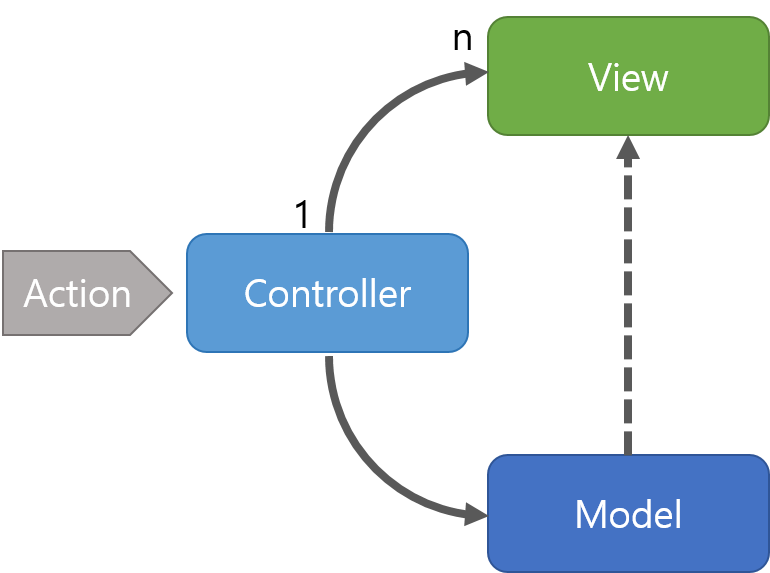
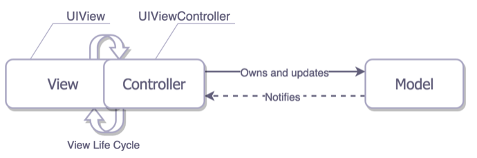
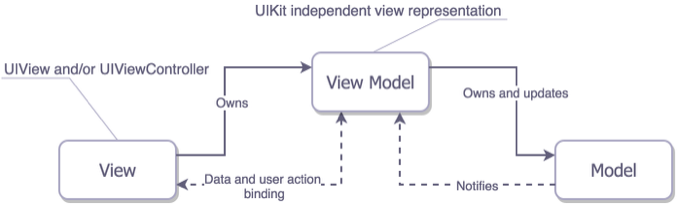

##### 여러가지 디자인 패턴이 나온이유는?
> 각각의 역할을 나눠서 코드를 관리하기 위해서!  
> 유지보수가 편리하고 개발의 효율성을 높이기 위해서!

 

## MVC : Model - View - Controller 

#### [MVC]

 

### 동작

1. 사용자의 Action들은 Controller에 들어오게 됩니다.
1. Controller는 사용자의 Action를 확인하고, Model을 업데이트합니다.
1. Controller는 Model을 나타내줄 View를 선택합니다.
1. View는 Model을 이용하여 화면을 나타냅니다.

### 특징
- Controller는 여러개의 View를 선택할 수 있는 1:n 구조입니다.
- Controller는 View를 선택할 뿐 직접 업데이트 하지 않습니다. (View는 Controller를 알지 못합니다.)

### 장점
단순하고 구현이 쉽습니다.

### 단점
View와 Model 사이의 의존성이 높습니다.  
View와 Model의 의존성이 높으면 어플리케이션이 커질수록 복잡해지고 유지보수가 어려워집니다.

 

#### [iOS 에서의 MVC]

View와 Controller가 밀접하게 붙어있습니다.  
따라서 Controller에 정말 많은 코드가 작성됩니다.

  

## MVVM : Model - View - ViewModel

### 동작 
1. 사용자의 Action들은 View를 통해 들어오게 됩니다.
1. View에 Action이 들어오면, Command 패턴으로 View Model에 Action을 전달합니다.
1. View Model은 Model에게 데이터를 요청합니다.
1. Model은 View Model에게 요청받은 데이터를 응답합니다.
1. View Model은 응답 받은 데이터를 가공하여 저장합니다.
1. View는 View Model과 Data Binding하여 화면을 나타냅니다.

###### Command 패턴: 요청을 객체의 형태로 캡슐화하여 사용자가 보낸 요청을 나중에 이용할 수 있도록 매서드 이름, 매개변수 등 요청에 필요한 정보를 저장 또는 로깅, 취소할 수 있게 하는 패턴
###### Data Binding: 앱 UI와 해당 UI가 표시하는 데이터를 연결하는 프로세스

 

### 특징
- Command 패턴과 Data Binding을 이용하여 View와 View Model 사이의 의존성을 없앴습니다.
- View Model과 View는 1:n 관계입니다.

### 장점
- View와 Model사이의 의존성이 없습니다.
- Command 패턴과 Data Binding을 사용하여 View와 ViewModel 사이의 의존성 또한 없앴습니다.
- 각각의 부분은 독립적이기 때문에 모듈화하여 개발할 수 있습니다.

 

#### [iOS 에서의 MVVM]

출처  
[beomy](https://beomy.tistory.com/43)  
[김종권의 iOS 앱개발 알아가기](https://ios-development.tistory.com/75)