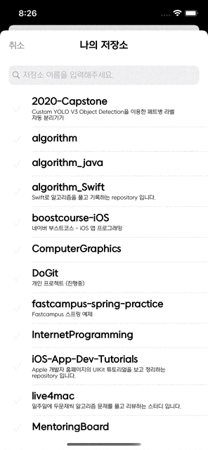
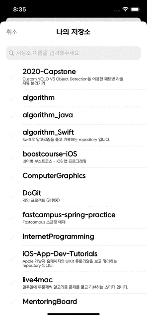

# 두깃

### git repository 별로 Todo List 를 만들 수 있는 어플리케이션

  

> 만들게 된  이유

Github의 여러 Repository에 커밋을 하다보니 issue를 작성하는 것보다
가벼운 Github Repository 만의 Todo를 사용하고 싶어 제작하게 되었습니다.

 

> 기간

2022.04.05 ~ 진행중

 

> 지원하는 플랫폼

iOS 15 이상

 

> 사용 기술

MVC, Singleton  
UIKit - UI, CollectionView, DiffableDataSource  
DB - Realm

 

> 기능

- Repository 목록 검색, 추가  

 

 

- Repository 목록에 할일 추가하기

 

- 할일 삭제하기

 

> 추후 추가 기능

- 알림 기능