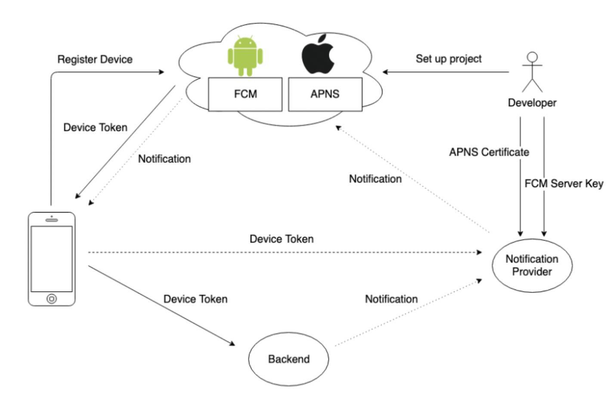

# FCM Remote Notification (서버 푸시알림)



# FCM 앱에서 Rest api 보내기

### 방식
1. http
2. http v1

[FCM http, http v1](https://firebase.google.com/docs/cloud-messaging/migrate-v1?hl=ko)


```Swift
import Foundation

final class FCMDataManager {
    
    // MARK: - Properties
    private static let urlString = "https://fcm.googleapis.com/fcm/send"
    
    // 숨겨야함
    private static let serverKey = "key=AAAA-cFoBYI:APA91bE9..."
    
    private static func sendNotification(messageRequest: MessageRequest<UserNotification>, completion: @escaping (Result<Data, NetworkError>) -> Void) {
        
        guard let url = URL(string: urlString) else {
            completion(.failure(.invalidURL))
            return
        }
        guard let httpBody = createPostPayload(from: messageRequest) else {
            completion(.failure(.encodingError))
            return
        }
        print(String(decoding: httpBody, as: UTF8.self))
        
        var request = URLRequest(url: url)
        request.httpMethod = "post"
        request.addValue("application/json", forHTTPHeaderField: "Content-Type")
        request.addValue("application/json", forHTTPHeaderField: "Accept")
        request.addValue(serverKey, forHTTPHeaderField: "Authorization")
        request.httpBody = httpBody
        
        URLSession.shared.dataTask(with: request) { data, response, error in
            guard let httpResponse = response as? HTTPURLResponse else {
                completion(.failure(.unknownError))
                return
            }
            if let _ = error {
                completion(.failure(.httpError(errorCode: httpResponse.statusCode)))
                return
            }
            guard 200...299 ~= httpResponse.statusCode else {
                completion(.failure(.httpError(errorCode: httpResponse.statusCode)))
                return
            }
            guard let data = data else {
                completion(.failure(.missingDataError))
                return
            }
            print(String(decoding: data, as: UTF8.self))
            completion(.success(data))
        }.resume()
    }
    
    private static func createPostPayload<T: Codable>(from requestBody: T) -> Data? {
        if let data = requestBody as? Data {
            return data
        }
        return try? JSONEncoder().encode(requestBody)
    }
    
    static func sendMessage(_ message: Message, fcmToken: String) {
        
        let userNotification = UserNotification(
            userID: message.sender.userID,
            nickname: message.sender.nickname,
            profileImageURL: message.sender.profileImageURL)
        
        let messageRequest = MessageRequest(
            title: message.sender.nickname,
            body: message.content,
            data: userNotification,
            to: fcmToken)
        
        sendNotification(messageRequest: messageRequest) { result in
            switch result {
            case .success:
                return
            case .failure(let error):
                guard let errorDescription = error.errorDescription else { return }
                print("메세지 알림 전송 에러: \(errorDescription)")
                return
            }
        }
    }
}


```